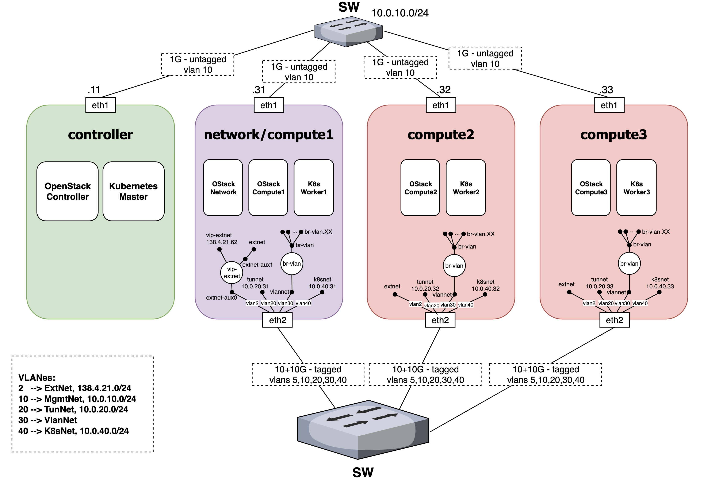

# B5Gemini ACROSS Experiment Stack

[](./README.md)

This repository contains the requirements, instructions and scripts to execute experiments on the B5Gemini cluster.

## Table of Contents

1. [Scenario Description](#scenario-description)
    - [Architecture and software](#architecture-and-software)
    - [Network connections](#network-connections)
    - [Virtual scenario structure](#virtual-scenario-structure)

2. [Scenario deployment and experiment execution](#scenario-deployment-and-experiment-execution)
    - [*clabernetes* installation](#clabernetes-installation)
    - [Deployment modification for VlanNet connectivity](#deployment-modification-for-vlannet-connectivity)
    - [*Network emulation* deployment using containerlab topology in clabernetes](#network-emulation-deployment-using-containerlab-topology-in-clabernetes)
    - [*Monitoring stack* and Apache Kafka deployment](#monitoring-stack-and-apache-kafka-deployment)
    - [*ML Stack* deployment](#ml-stack-deployment)
    - [*Network control stack* deployment](#network-control-stack-deployment)
        - [NetworkInfo generator](#networkinfo-generator)
        - [Basic usage](#basic-usage)
        - [Customization for other topologies](#customization-for-other-topologies)
        - [Deployment on b5g](#deployment-on-b5g)
    - [*Experiment analysis stack* deployment](#experiment-analysis-stack-deployment)
        - [InfluxDB initial configuration](#influxdb-initial-configuration)
        - [MinIO initial configuration](#minio-initial-configuration)
        - [Complete deployment](#complete-deployment)
    - [Experiment execution using Ixia-c traffic generator](#experiment-execution-using-ixia-c-traffic-generator)

## Scenario Description

For the purposes of the experiments contained in this repository, the B5Gemini cluster has one machine that acts as a controller and four others that act as compute nodes.

### Architecture and software



> The cluster has an additional *compute4* node with the same configuration, but it is not shown in this diagram.

As indicated in the diagram, the [OpenStack](https://www.openstack.org/) virtualization platform and the [Kubernetes](https://kubernetes.io/es/) container orchestration platform are deployed on the cluster, on which the virtualized infrastructure for the experiments will run.

Additionally, the following components run on Kubernetes:

- [Calico CNI](https://github.com/projectcalico/calico)
- [Multus CNI](https://github.com/k8snetworkplumbingwg/multus-cni)
- [Ingress Nginx Controller](https://github.com/kubernetes/ingress-nginx)
- [MetalLB](https://metallb.io/)

### Network connections


> The cluster has an additional *compute4* node with the same configuration, but it is not shown in this diagram.

Connectivity between nodes is established through a switch that handles traffic on various interfaces. The experiments contained here focus especially on the use of VLAN 30 network with virtual network bridges that allow establishing a second tagging for traffic segmentation.

### Virtual scenario structure


The virtual scenario for experiments has various components that work together:

- **[Network emulation:](https://github.com/giros-dit/vnx-srv6/tree/2a17b347e72d9924978e8420d59725933f514c7e/)** Virtual [containerlab](https://containerlab.dev) network deployed using [clabernetes](https://containerlab.dev/manual/clabernetes/) on which to route traffic for experiments. Transport network routers report metrics to the *Monitoring stack* and establish their routes based on commands from the *Network control stack*. Connectivity between nodes is done using VLAN networks (over VlanNet) through *Multus* interfaces, which allows significantly reducing link latency.

- **[Monitoring stack:](https://github.com/giros-dit/ACROSS-monitoring-stack/tree/97993debcef5e3796ac7907b4f74273fa063a22b/)** Collects and processes metrics from selected interfaces of transport network routers to make them available to the *ML Stack*.

- **ML stack:** Performs energy consumption calculation from metrics provided by the *Monitoring stack* for use in route creation by the *Network control stack*.

- **[Network control stack:](https://github.com/giros-dit/vnx-srv6/tree/59c3757189516f9d707a5cb015e68b1cb6f84cc4/NetworkControlStack/)** Performs route calculation based on data provided by the *ML stack*.

- **NDT Data Fabric:** Apache Kafka deployment where each component publishes processed data, using a *topic* per router and stage.

- **[Experiment analysis stack:](https://github.com/giros-dit/experiment-analysis-stack/tree/cf000addb114eb5441d7c730310f22dd3bb3d11b/)** Consists of an [*InfluxDB*](https://www.influxdata.com/products/influxdb/) instance to store time series and visualize telemetry data in real time. Additionally, it has an instance of the [*MinIO*](https://min.io/) storage server where a replica of data is permanently stored in *S3*-compatible format. It is the only set of resources deployed on a "heavy" virtual machine in *OpenStack*.

## Scenario deployment and experiment execution

This section contains instructions for setting up the virtual scenario, assuming you already have a fully functional Kubernetes cluster with the necessary software described in the [Architecture and Software](#architecture-and-software) section.

### *clabernetes* installation

The [clabernetes quick start guide](https://containerlab.dev/manual/clabernetes/quickstart/) contains the necessary commands to install the tool in our Kubernetes cluster to handle the conversion of *Topology* objects that we deploy on it. Below is a summary of the commands needed for its setup:

```shell
alias helm='docker run --network host -ti --rm -v $(pwd):/apps -w /apps \
    -v ~/.kube:/root/.kube -v ~/.helm:/root/.helm \
    -v ~/.config/helm:/root/.config/helm \
    -v ~/.cache/helm:/root/.cache/helm \
    alpine/helm:3.12.3'
```

```shell
helm upgrade --install --create-namespace --namespace c9s \
    clabernetes oci://ghcr.io/srl-labs/clabernetes/clabernetes
```

### Deployment modification for VlanNet connectivity

To use the VlanNet network for communication between clabernetes nodes in our scenario, it is necessary to make available to the *pods* the *Multus* *NetworkAttachmentDefinition* objects that allow connection with interfaces of the Kubernetes *worker* node host.

An **example** of the command to define these objects is as follows:

```shell
NS=c9s-nodes3; cat <<EOF | kubectl create -f -
apiVersion: "k8s.cni.cncf.io/v1"
kind: NetworkAttachmentDefinition
metadata:
  name: net1000
  namespace: $NS
spec:
  config: '{
      "cniVersion": "0.3.0",
      "type": "macvlan",
      "master": "br-vlan.1000",
      "mode": "bridge",
      "ipam": {}
    }'
EOF
```

> If the name of this definition does not match the one established in the containerlab topology file **the pods will not start**.

### *Network emulation* deployment using containerlab topology in clabernetes

Deploying a containerlab topology in clabernetes is trivial using the `clabverter` tool. **This tool has been [modified](https://github.com/giros-dit/clabernetes/tree/d6ef1739a27d58ea0f14a8bf7e9898a63946f050/clabverter/) for our scenario, so that the necessary patches are generated for using interfaces created through *Multus*.** To do this, simply indicate in the topology file a *link* element where one of the links is of *Multus* type `"multus:<interface name>"`.

> If the name of this interface does not match the one established in the definition of a *Multus* *NetworkAttachmentDefinition* object deployed in the *namespace* of our topology **the pods will not start**.

To be able to use clabverter directly from the command line without performing installations, we will run:

```shell
alias clabverter='sudo docker run --user $(id -u) \
    -v $(pwd):/clabernetes/work --rm \
    ghcr.io/giros-dit/clabernetes/clabverter'
```

> Since this is an image stored privately in the GitHub organization's container registry, authentication is necessary to access it. The procedure to generate an authentication token can be found [here](https://docs.github.com/es/packages/working-with-a-github-packages-registry/working-with-the-container-registry#autenticarse-en-el-container-registry).

To use clabverter, simply navigate to the directory where our topology is located and run:

```shell
clabverter --naming non-prefixed --outputDirectory ./converted
```

> Currently, this version of clabverter only works correctly if the `--naming non-prefixed` parameter is present.
> A complete list of options can be consulted by running `clabverter -h`.

This modified clabverter image will export the files:

- `_<topology name>-ns.yaml`: Creates the *namespace* where the topology will be deployed. Can be omitted if we work on an existing *namespace* that has been defined using the `--namespace` option of clabverter.

- `<topology name>.yaml`: File that deploys a *Topology* object on the indicated *namespace*. Clabernetes will automatically create the necessary resources (*deployments*, *services*...) to execute the topology.

- `deployment-patcher.sh`: Must be executed after deployment in the cluster to perform configuration of *Multus* interfaces.

- Additional files: Such as configuration files or licenses. These will be exported as Kubernetes [ConfigMaps](https://kubernetes.io/docs/concepts/configuration/configmap/) for use in the cluster.

> To be able to apply the patches, the [`yq`](https://mikefarah.gitbook.io/yq) tool is used through [its Docker image](https://hub.docker.com/r/mikefarah/yq). To avoid errors, it is recommended to run a `docker pull` with the tool's image before executing `deployment_patcher.sh`. The tests have been performed with version 4.44.5.

The experiments mainly use the topologies [redAcross6nodes](https://github.com/giros-dit/vnx-srv6/tree/59c3757189516f9d707a5cb015e68b1cb6f84cc4/clabernetes/redAcross6nodes/) and [redAcross10nodes](https://github.com/giros-dit/vnx-srv6/tree/59c3757189516f9d707a5cb015e68b1cb6f84cc4/clabernetes/redAcross10nodes/).

### *Monitoring stack* and Apache Kafka deployment

The Monitoring Stack deployment and service communication infrastructure is performed using the [k8s-deploy.sh](https://github.com/giros-dit/ACROSS-monitoring-stack/tree/e87348c3eddeb84a587860c98594c24851018582/Kubernetes/k8s-deploy.sh) script responsible for deploying:

- Apache Kafka broker
- Node Exporter Collector
- Kafka Producer microservice
- Flink Operator Cluster
- ML Stack

The execution of this script requires two parameters as input arguments to define the router type and model type that the Machine Learning stack, [ML Stack](#ml-stack-deployment), will use.

```shell
./k8s-deploy.sh <router_type> <model_type>
```
- **<router_type>**: Type of router to use, for example `huawei`.
- **<model_type>**: Type of model to use: `linear`, `MLP`, `polynomial`, `rf`.

Both the router type <router_type>: `huawei`, and the model type <model_type>: `linear` are the default values used if the input parameters are not specified.

## Experiment

To change the telemetry system parameters to perform 
a new experiment, you need to:

 - **Edit ConfigMap config-json**

 ```shell
$ kubectl edit configmap config-json
 ```
 - **Restart Kafka Producer microservice**

 ```shell
$ kubectl rollout restart deployment kafka-producer
 ```

### *ML Stack* deployment

The deployment of the ML Stack is triggered from the general deployment script of the Monitoring Stack using the input arguments <router_type> and <model_type> defined in [k8s-deploy.sh](https://github.com/giros-dit/ACROSS-monitoring-stack/tree/e87348c3eddeb84a587860c98594c24851018582/Kubernetes/k8s-deploy.sh).
However, there is an additional script, [launch_ml_stack.sh](https://github.com/giros-dit/ACROSS-monitoring-stack/tree/e87348c3eddeb84a587860c98594c24851018582/Kubernetes/scripts/ml_models/launch_ml_stack.sh), that allows deploying the Machine Learning inference engine stack for all routers in the network scenario specified in the [config.json](https://github.com/giros-dit/ACROSS-monitoring-stack/tree/e87348c3eddeb84a587860c98594c24851018582/Kubernetes/config/config.json) configuration file.

```shell
./launch_ml_stack.sh <router_type> <model_type>
```

 - **<router_type>**: Router type to use, for example `huawei`.
 - **<model_type>**: Model type to use: `linear`, `MLP`, `polynomial`, `rf`.

Both the router type <router_type>: `huawei`, and the model type <model_type>: `linear` are the default values used if the input parameters are not specified.

This script deploys as many models of ML as routers in the network scenario, specified in the [config.json](https://github.com/giros-dit/ACROSS-monitoring-stack/tree/e87348c3eddeb84a587860c98594c24851018582/Kubernetes/config/config.json) configuration file, all with the same router type <router_type> and model type <model_type> specified as input arguments.

At the same time, there is another script that allows deploying a single model of ML for the router specified as input argument, so that over a stack of deployed models, it is possible to change the router type or model type for any of them, through the script [launch_ml_model.sh](https://github.com/giros-dit/ACROSS-monitoring-stack/tree/e87348c3eddeb84a587860c98594c24851018582/Kubernetes/scripts/ml_models/launch_ml_model.sh).

```shell
./launch_ml_model.sh <router_id> <router_type> <model_type>
```

 - **<router_id>**: Router ID to use, for example `r1`, `r2`, `r3`, `r4`, `r5`, `r6` or `r7`.
 - **<router_type>**: Router type to use, for example `huawei`.
 - **<model_type>**: Model type to use: `linear`, `MLP`, `polynomial`, `rf`.

Both the router type <router_type>: `huawei`, and the model type <model_type>: `linear` are the default values used if the input parameters are not specified.

The three scripts [k8s-deploy.sh](https://github.com/giros-dit/ACROSS-monitoring-stack/tree/e87348c3eddeb84a587860c98594c24851018582/Kubernetes/k8s-deploy.sh), [launch_ml_stack.sh](https://github.com/giros-dit/ACROSS-monitoring-stack/tree/e87348c3eddeb84a587860c98594c24851018582/Kubernetes/scripts/ml_models/launch_ml_stack.sh) and [launch_ml_model.sh](https://github.com/giros-dit/ACROSS-monitoring-stack/tree/e87348c3eddeb84a587860c98594c24851018582/Kubernetes/scripts/ml_models/launch_ml_model.sh) use as default values the router type and model type `huawei` and `linear`, respectively, if the input parameters are not specified. In contrast to the last script [launch_ml_model.sh](https://github.com/giros-dit/ACROSS-monitoring-stack/tree/e87348c3eddeb84a587860c98594c24851018582/Kubernetes/scripts/ml_models/launch_ml_model.sh), it is necessary to identify the router ID to use, for example: r1, r2, r3, r4, r5, r6 or r7.

### *Network control stack* deployment

First, you need to have a json file called networkinfo that describes the topology. To obtain this file, there is a program called `generate_networkfile.py`

#### NetworkInfo generator

Script that generates a JSON file with network information (connectivity graph and loopback addresses) from a Containerlab topology.

#### Basic usage

```bash
# Standard topology (nodes r1, r2... ru, rg, rc)
python3 networkinfo.py /path/to/topology.clab.yml

# Specify output file
python3 networkinfo.py /path/to/topology.clab.yml --output red.json
```

#### Customization for other topologies

If your nodes **do not start with "r"**, modify `--full_filter`:

```bash
# Nodes router1, router2...
python3 networkinfo.py /path/to/topology.clab.yml --full_filter "^(router.*)$"
```

If your border nodes **are not called ru/rg/rc**, modify `--final_filter`:

```bash
# Border: edge1, edge2, core
python3 networkinfo.py /path/to/topology.clab.yml --final_filter "^(edge\d+|core)$"
```

**Complete program documentation**
For more examples and detailed use cases, consult the [complete documentation](https://github.com/giros-dit/vnx-srv6/blob/59c3757189516f9d707a5cb015e68b1cb6f84cc4/NetworkControlStack/readme_networkinfo.md).

#### Deployment on b5g

⚠️ Important: Once the networkinfo.json file is generated, you must copy it to the vnx-srv6 repository folder:

```bash
cp networkinfo.json /path/to/vnx-srv6/NetworkControlStack/k8s/
```

The Network Control Stack execution parameters can be configured in the networkstack.yaml file, which defines the Kubernetes deployment.

- `ENERGYAWARE`: if set to `"true"`, energy consumption inference is activated in route calculation.
- `DEBUG_COSTS`: if set to `"true"`, debug mode is enabled to see detailed information about route and cost calculation.

With the topology definition file, execute in the `k8s` folder

```bash
cd /path/to/vnx-srv6/NetworkControlStack/k8s/
./deploy.sh
```

To remove all containers and Network Control Stack resources, you can use the delete.sh script included in the same folder:

```bash
./delete.sh
```

### *Experiment analysis stack* deployment

The [*Experiment analysis stack*](https://github.com/giros-dit/experiment-analysis-stack/tree/77ea936418872a7176a505d9f102b8d02a8ca0b4/) consists of a series of Docker containers that run the following services:

- [**InfluxDB:**](https://www.influxdata.com/products/influxdb/) Time series database and real-time graph visualization interface.

- [**Telegraf:**](https://github.com/influxdata/telegraf) Data collector for InfluxDB with various integrations (e.g. *Kafka*).

- [**MinIO:**](https://min.io/) Storage server compatible with [*Amazon S3*](https://aws.amazon.com/es/s3/) to make persistent copies of experiment data.

- [**S3 Consumer**](https://github.com/giros-dit/experiment-analysis-stack/tree/ae45969e6b34bc7fdb11f3c0895134ccc7e22580/s3_consumer.py): *Python* script that acts as a *Kafka* consumer and saves captured messages to *MinIO* storage.

This *Docker Compose* deployment is the only component that needs to be deployed outside the cluster, on an OpenStack virtual machine. In our scenario, this machine has the following requirements:

- 4 vCPU
- 8GB RAM
- 40GB HDD
- 1 static IP address
- Ubuntu 22.04

Additionally, it is essential to have a [Docker](https://www.docker.com/) installation on this machine.

#### InfluxDB initial configuration

Prior to deploying the [docker-compose.yml](https://github.com/giros-dit/experiment-analysis-stack/tree/ae45969e6b34bc7fdb11f3c0895134ccc7e22580/docker-compose.yml) file, it is necessary to initialize a
