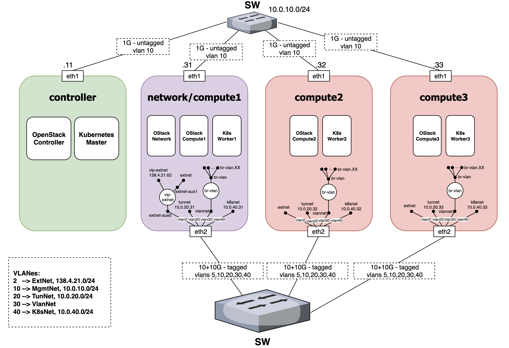
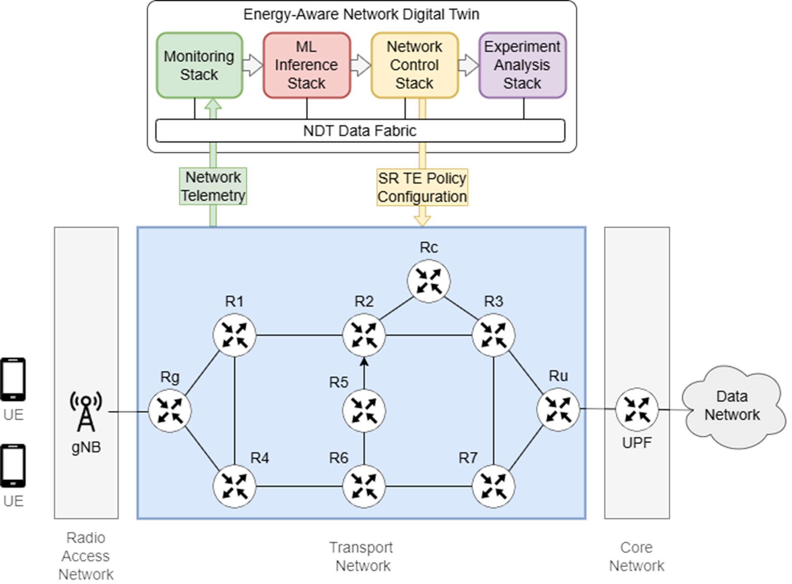
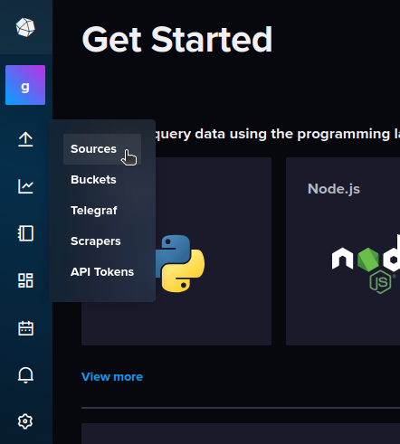
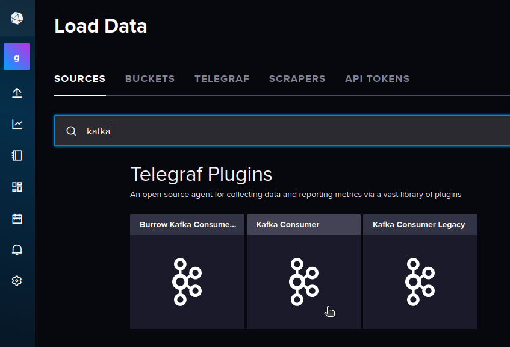
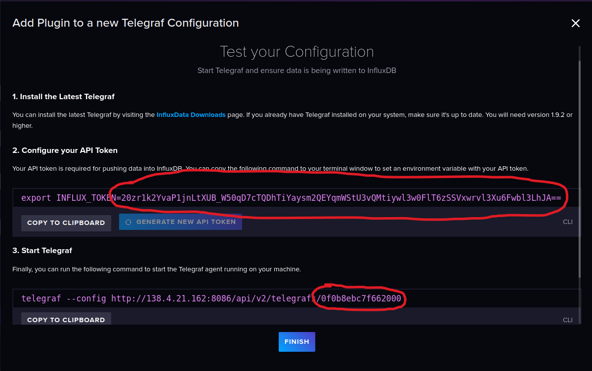

# B5Gemini ACROSS Experiment Stack

[](./README.en.md)

Este repositorio contiene los requisitos, instrucciones y scripts para ejecutar experimentos sobre el clúster B5Gemini.

## Índice

1. [Descripción del escenario](#descripción-del-escenario)
    - [Arquitectura y software](#arquitectura-y-software)
    - [Conexiones de red](#conexiones-de-red)
    - [Estructura del escenario virtual](#estructura-del-escenario-virtual)

2. [Despliegue del escenario y ejecución de experimentos](#despliegue-del-escenario-y-ejecución-de-experimentos)
    - [Instalación de *clabernetes*](#instalación-de-clabernetes)
        - [Modificación del despliegue para conectividad mediante VlanNet](#modificación-del-despliegue-para-conectividad-mediante-vlannet)
        - [Despliegue del *Network emulation* mediante una topología de containerlab en clabernetes](#despliegue-del-network-emulation-mediante-una-topología-de-containerlab-en-clabernetes)
        - [Despliegue del *Monitoring stack* y Apache Kafka](#despliegue-del-monitoring-stack-y-apache-kafka)
        - [Despliegue del *ML Stack*](#despliegue-del-ml-stack)
        - [Despliegue del *Network control stack*](#despliegue-del-network-control-stack)
            - [Generador de NetworkInfo](#generador-de-networkinfo)
            - [Uso básico](#uso-básico)
            - [Personalización para otras topologías](#personalización-para-otras-topologías)
            - [Despliegue en el b5g](#despliegue-en-el-b5g)
        - [Despliegue del *Experiment analysis stack*](#despliegue-del-experiment-analysis-stack)
            - [Configuración inicial de InfluxDB](#configuración-inicial-de-influxdb)
            - [Configuración inicial de MinIO](#configuración-inicial-de-minio)
            - [Despliegue completo](#despliegue-completo)
        - [Creación y ejecución de experimentos mediante el generador de tráfico Ixia-c](#creación-y-ejecución-de-experimentos-mediante-el-generador-de-tráfico-ixia-c)

## Descripción del escenario

A efectos de los experimentos recogidos en este repositorio, el clúster B5Gemini cuenta con una máquina que actúa de controlador y otras cuatro que actúan como nodos de computación.

### Arquitectura y software



> El clúster cuenta con un nodo *compute4* adicional con la misma configuración, pero que no figura en este diagrama.

Tal y como se indica en el gráfico, sobre el clúster se encuentran desplegadas la plataforma de virtualización [OpenStack](https://www.openstack.org/) y la plataforma de orquestación de contenedores [Kubernetes](https://kubernetes.io/es/), sobre los que se ejecutará la infraestructura virtualizada para los experimentos.

Adicionalmente, sobre Kubernetes se ejecutan los siguientes componentes:

- [Calico CNI](https://github.com/projectcalico/calico)
- [Multus CNI](https://github.com/k8snetworkplumbingwg/multus-cni)
- [Ingress Nginx Controller](https://github.com/kubernetes/ingress-nginx)
- [MetalLB](https://metallb.io/)

### Conexiones de red


> El clúster cuenta con un nodo *compute4* adicional con la misma configuración, pero que no figura en este diagrama.

La conectividad entre nodos se establece mediante un conmutador que se para el tráfico en diversas interfaces. Los experimentos aquí recogidos se centran especialmente en el empleo de las red VLAN 30 con puentes de red virtuales que permitan establecer un segundo etiquetado para la segmentación del tráfico.

### Estructura del escenario virtual



El escenario virtual para experimentos cuenta con diversos componentes que trabajan conjuntamente:

- **[Network emulation:](https://github.com/giros-dit/vnx-srv6/tree/2a17b347e72d9924978e8420d59725933f514c7e/)** Red virtual de [containerlab](https://containerlab.dev) desplegada mediante [clabernetes](https://containerlab.dev/manual/clabernetes/) sobre la que cursar tráfico para realizar experimentos. Los enrutadores de la red de transporte reportan métricas al *Monitoring stack* y establecen sus rutas en función de los comandos del *Network control stack*. La conectividad entre nodos se realiza empleando redes VLAN (sobre la VlanNet) a través de interfaces de *Multus*, lo que permite reducir significativamente la latencia de los enlaces.

- **[Monitoring stack:](https://github.com/giros-dit/ACROSS-monitoring-stack/tree/97993debcef5e3796ac7907b4f74273fa063a22b/)** Recoge y procesa las métricas de las interfaces seleccionadas de los enrutadores de la red de transporte para ponerlas a disposición del *ML Stack*.

- **ML stack:** Realiza el cálculo de consumo energético a partir de las métricas proporcionados por el *Monitoring stack* para su uso en la creación de rutas por parte del *Network control stack*.

- **[Network control stack:](https://github.com/giros-dit/vnx-srv6/tree/c72db89ff44b3050c68a8548313c43ff750f1b41/NetworkControlStack/)** Realiza el cálculo de rutas en función de los datos proporcionados por el *ML stack*.

- **NDT Data Fabric:** Despliegue de Apache Kafka en el que cada uno de los componentes publica los datos procesados, empleando para ello un *topic* por enrutador y etapa.

- **[Experiment analysis stack:](https://github.com/giros-dit/experiment-analysis-stack/tree/cf000addb114eb5441d7c730310f22dd3bb3d11b/)** Consta de una instancia de [*InfluxDB*](https://www.influxdata.com/products/influxdb/) para almacenar series temporales y visualizar los datos de telemetría en tiempo real. Además, cuenta con una instancia del servidor de almacenamiento [*MinIO*](https://min.io/) en el que se almacena una replica de los datos de forma permanente y en formato compatible con *S3*. Es el único conjunto de recursos desplegado sobre una máquina virtual "pesada" en *OpenStack*.

## Despliegue del escenario y ejecución de experimentos

Esta sección contiene las instrucciones para la puesta en marcha del escenario virtual, asumiendo que ya se cuenta con un clúster de Kubernetes completamente funcional y con el software necesario descrito en la sección de [Arquitectura y Software](#arquitectura-y-software).

### Instalación de *clabernetes*

La [guía de inicio rápido de clabernetes](https://containerlab.dev/manual/clabernetes/quickstart/) recoge los comandos necesarios para instalar la herramienta en nuestro clúster de Kubernetes para encargarse de la conversión de los objetos *Topology* que despleguemos sobre el mismo. A continuación se recoge un resumen de los comandos necesarios para su puesta en marcha:

```shell
alias helm='docker run --network host -ti --rm -v $(pwd):/apps -w /apps \
    -v ~/.kube:/root/.kube -v ~/.helm:/root/.helm \
    -v ~/.config/helm:/root/.config/helm \
    -v ~/.cache/helm:/root/.cache/helm \
    alpine/helm:3.12.3'
```

```shell
helm upgrade --install --create-namespace --namespace c9s \
    clabernetes oci://ghcr.io/srl-labs/clabernetes/clabernetes
```

### Modificación del despliegue para conectividad mediante VlanNet

Para el empleo de la red VlanNet para la comunicación entre los nodos de clabernetes de nuestro escenario, es necesario poner a disposición de los *pods* los objetos *NetworkAttachmentDefinition* de *Multus* que permiten la conexión con interfaces del host del nodo *worker* de Kubernetes.

Un **ejemplo** del comando de definición de estos objetos es la siguiente:

```shell
NS=c9s-nodes3; cat <<EOF | kubectl create -f -
apiVersion: "k8s.cni.cncf.io/v1"
kind: NetworkAttachmentDefinition
metadata:
  name: net1000
  namespace: $NS
spec:
  config: '{
      "cniVersion": "0.3.0",
      "type": "macvlan",
      "master": "br-vlan.1000",
      "mode": "bridge",
      "ipam": {}
    }'
EOF
```

> Si el nombre esta definición no coincide con la establecida en el fichero de topología de containerlab **los pods no arrancarán**.

### Despliegue del *Network emulation* mediante una topología de containerlab en clabernetes

El despliegue de una topología de containerlab en clabernetes resulta trivial empleando la herramienta `clabverter`. **Esta herramienta ha sido [modificada](https://github.com/giros-dit/clabernetes/tree/d6ef1739a27d58ea0f14a8bf7e9898a63946f050/clabverter/) para nuestro escenario, de modo que se generen los parches necesarios para el uso de interfaces creadas mediante *Multus*.** Para ello, basta con indicar en el fichero de topología un elemento *link* en el que uno de los enlaces sea de tipo *Multus* `"multus:<nombre de la interfaz>"`.

> Si el nombre esta interfaz no coincide con la establecida en la definición de un objeto de tipo *NetworkAttachmentDefinition* de *Multus* desplegado en el *namespace* de nuestra topología **los pods no arrancarán**.

Para poder emplear clabverter directamente desde la línea de comandos y sin realizar instalaciones, ejecutaremos:

```shell
alias clabverter='sudo docker run --user $(id -u) \
    -v $(pwd):/clabernetes/work --rm \
    ghcr.io/giros-dit/clabernetes/clabverter'
```

> Al tratarse de una imagen almacenada de forma privada en el registro de contenedores de la organización de GitHub, es necesario autenticarse para acceder a ella. El procedimiento para generar un token de autenticación puede encontrarse [aquí](https://docs.github.com/es/packages/working-with-a-github-packages-registry/working-with-the-container-registry#autenticarse-en-el-container-registry).

Para usar clabverter basta con desplazarse al directorio en el que se encuentra nuestra topología y ejecutar:

```shell
clabverter --naming non-prefixed --outputDirectory ./converted
```

> Por el momento, esta versión de clabverter solo funciona correctamente si se encuentra presente el parámetro `--naming non-prefixed`.
> Pueden consultarse un listado completo de opciones ejecutando `clabverter -h`.

Esta imagen modificada de clabverter exportará los ficheros:

- `_<nombre de la topología>-ns.yaml`: Crea el *namespace* en el que se desplegará la topología. Puede omitirse si trabajamos sobre un *namespace* existente que haya sido definido mediante la opción `--namespace` de clabverter.

- `<nombre de la topología>.yaml`: Fichero que despliega un objeto *Topology* sobre el *namespace* indicado. Clabernetes creará automáticamente los recursos necesarios (*deployments*, *services*...) para ejecutar la topología.

- `deployment-patcher.sh`: Debe ejecutarse tras el despliegue en el clúster para realizar la configuración de las interfaces *Multus*.

- Ficheros adicionales: Como ficheros de configuración o licencias. Estos serán exportados como [ConfigMaps](https://kubernetes.io/docs/concepts/configuration/configmap/) de Kubernetes para su uso en el clúster.

> Para poder aplicar los parches se emplea la herramienta [`yq`](https://mikefarah.gitbook.io/yq) mediante [su imagen de Docker](https://hub.docker.com/r/mikefarah/yq). Para evitar errores, es recomendable ejecutar un `docker pull` con la imagen de la herramienta antes de ejecutar el `deployment_patcher.sh`. Las pruebas han sido realizadas con la versión 4.44.5.

Los experimentos cursados emplean principalmente las topologías [redAcross6nodes](https://github.com/giros-dit/vnx-srv6/tree/c72db89ff44b3050c68a8548313c43ff750f1b41/clabernetes/redAcross6nodes/) y [redAcross10nodes](https://github.com/giros-dit/vnx-srv6/tree/c72db89ff44b3050c68a8548313c43ff750f1b41/clabernetes/redAcross10nodes/).

### Despliegue del *Monitoring stack* y Apache Kafka

Existen dos scripts de despliegue para la arquitectura del sistema de telemetría que despliegan:

- Apache Kafka broker
- Node Exporter Collector
- Kafka Producer microservice
- Flink Operator Cluster
- ML Stack

- [k8s-deploy-ml-models.sh](https://github.com/giros-dit/ACROSS-monitoring-stack/tree/470949c79b7fbc4616d4b69123d252f465411674/Kubernetes/k8s-deploy-ml-models.sh):
Despliega **Monitoring Stack**, **NDT Data Fabric** y **Machine Learning Stack** con ML models.
- [k8s-deploy-ml-dummy.sh](https://github.com/giros-dit/ACROSS-monitoring-stack/tree/470949c79b7fbc4616d4b69123d252f465411674/Kubernetes/k8s-deploy-ml-dummy.sh):
Despliega **Monitoring Stack**, **NDT Data Fabric** y **Machine Learning Stack** con ML dummy.

La ejecución del script [k8s-deploy-ml-models.sh](https://github.com/giros-dit/ACROSS-monitoring-stack/tree/470949c79b7fbc4616d4b69123d252f465411674/Kubernetes/k8s-deploy-ml-models.sh) requiere dos parámetros de entrada para definir el tipo de router y el tipo de modelo que utilizará la pila de Machine Learning, ML Stack.

```shell
./k8s-deploy.sh <router_type> <model_type>
```

- **<router_type>**: Tipo de router a emplear, por ejemplo `huawei`.
- **<model_type>**: Tipo de modelo a emplear: `linear`. `MLP`, `polynomial`, `rf`.

Tanto el tipo de router <router_type>: `huawei`, como el tipo de modelo <model_type>: `linear` son los valores por defecto que se utlizan si no se especifican los parámetros de entrada.

El script [k8s-deploy-ml-dummy.sh](https://github.com/giros-dit/ACROSS-monitoring-stack/tree/470949c79b7fbc4616d4b69123d252f465411674/Kubernetes/k8s-deploy-ml-dummy.sh) no requiere ningún parámetro de entrada.

## Experiment

Para definir un nuevo experimento a realizar, es necesario configurar los parámetros de definición de experimentos editando el fichero [config.json](https://github.com/giros-dit/ACROSS-monitoring-stack/tree/470949c79b7fbc4616d4b69123d252f465411674/Kubernetes/config/config.json) y reiniciar el microservicio Kafka Producer encargado de leer estos parámetros:

- **Editar ConfigMap config-json**

 ```shell
kubectl edit configmap config-json
 ```

- **Reiniciar el microservicio Kafka Producer**

 ```shell
kubectl rollout restart deployment kafka-producer
 ```

### Despliegue del *ML Stack*

El despliegue del *ML Stack* se invoca desde el script de despliegue general del *Monitoring Stack* gracias a los argumentos de entrada <router_type> y <model_type> definidos en [k8s-deploy.sh](https://github.com/giros-dit/ACROSS-monitoring-stack/tree/470949c79b7fbc4616d4b69123d252f465411674/Kubernetes/k8s-deploy.sh). Sin embargo, existe un script complementario [launch_ml_stack.sh](https://github.com/giros-dit/ACROSS-monitoring-stack/tree/470949c79b7fbc4616d4b69123d252f465411674/Kubernetes/scripts/ml_models/launch_ml_stack.sh) que permite desplegar la pila de motores de inferencia de Machine Learning para todos los routers del escenario de red especificados en el fichero de configuración [config.json](https://github.com/giros-dit/ACROSS-monitoring-stack/tree/470949c79b7fbc4616d4b69123d252f465411674/Kubernetes/config/config.json).

```shell
./launch_ml_stack.sh <router_type> <model_type>
```

- **<router_type>**: Tipo de router a emplear, por ejemplo `huawei`.
- **<model_type>**: Tipo de modelo a emplear: `linear`. `MLP`, `polynomial`, `rf`.

Tanto el tipo de router <router_type>: `huawei`, como el tipo de modelo <model_type>: `linear` son los valores por defecto que se utlizan si no se especifican los parámetros de entrada.

Este script despliega tantos modelos de ML como routers en el escenario de red, especificados en el fichero de configuración [config.json](https://github.com/giros-dit/ACROSS-monitoring-stack/tree/470949c79b7fbc4616d4b69123d252f465411674/Kubernetes/config/config.json), todos con el mismo tipo de router <router_type> y el modelo <model_type> especificado como argumentos de entrada.

A su vez, existe un último script que permite desplegar un único modelo de ML para el router especificado como argumento de entrada, de tal manera que sobre una pila de modelos de ML ya desplegada, se permite cambiar el tipo de router <router_type> o el tipo de modelo <model_type> para cualquiera de ellos, a través del script [launch_ml_model.sh](https://github.com/giros-dit/ACROSS-monitoring-stack/tree/470949c79b7fbc4616d4b69123d252f465411674/Kubernetes/scripts/ml_models/launch_ml_model.sh).

```shell
./launch_ml_model.sh <router_id> <router_type> <model_type>
```

- **<router_id>**: ID del router a emplear, por ejemplo `r1`, `r2`, `r3`, `r4`, `r5`, `r6` o `r7`.
- **<router_type>**: Tipo de router a emplear, por ejemplo `huawei`.
- **<model_type>**: Tipo de modelo a emplear: `linear`. `MLP`, `polynomial`, `rf`.

Tanto el tipo de router <router_type>: `huawei`, como el tipo de modelo <model_type>: `linear` son los valores por defecto que se utlizan si no se especifican los parámetros de entrada.

Los tres scripts [k8s-deploy.sh](https://github.com/giros-dit/ACROSS-monitoring-stack/tree/470949c79b7fbc4616d4b69123d252f465411674/Kubernetes/k8s-deploy.sh), [launch_ml_stack.sh](https://github.com/giros-dit/ACROSS-monitoring-stack/tree/470949c79b7fbc4616d4b69123d252f465411674/Kubernetes/scripts/ml_models/launch_ml_stack.sh) y [launch_ml_model.sh](https://github.com/giros-dit/ACROSS-monitoring-stack/tree/470949c79b7fbc4616d4b69123d252f465411674/Kubernetes/scripts/ml_models/launch_ml_model.sh) utilizan como valores por defecto los tipos de router y modelo `huawei` y `linear`, respectivamente, si no se especifican los parámetros de entrada. En cambio para el último script [launch_ml_model.sh](https://github.com/giros-dit/ACROSS-monitoring-stack/tree/470949c79b7fbc4616d4b69123d252f465411674/Kubernetes/scripts/ml_models/launch_ml_model.sh) es necesario identificar el ID del router a emplear, por ejemplo: r1, r2, r3, r4, r5, r6 o r7.

Para cambiar el ML Stack entre modelos ML y dummy ML, se puede utilizar el script [switch_ml_stack.sh](https://github.com/giros-dit/ACROSS-monitoring-stack/tree/470949c79b7fbc4616d4b69123d252f465411674/Kubernetes/scripts/ml_models/switch_ml_stack.sh) de la siguiente manera:

```shell
./scripts/ml_models/switch_ml_stack.sh ml-model
```

Este uso cambiaría de ML Stack dummy a ML Stack de modelos con valores por defecto para el tipo de router (huawei) y el tipo de modelo (linear).

```shell
./scripts/ml_models/switch_ml_stack.sh ml-model huawei rf
```

Este uso cambiaría de ML Stack dummy a ML Stack de modelos con el tipo de router y el tipo de modelo especificados.

```shell
./scripts/ml_models/switch_ml_stack.sh dummy
```

Este uso cambiaría de ML Stack de modelos a ML Stack dummy.

### Despliegue del *Network control stack*

Lo primero es tener un fichero json llamado networkinfo descriptor de la topología, para obtener este fichero existe un programa llamado `generate_networkfile.py`

#### Generador de NetworkInfo

Script que genera un archivo JSON con información de red (grafo de conectividad y direcciones loopback) desde una topología Containerlab.

#### Uso básico

```bash
# Topología estándar (nodos r1, r2... ru, rg, rc)
python3 networkinfo.py /path/to/topology.clab.yml

# Especificar archivo de salida
python3 networkinfo.py /path/to/topology.clab.yml --output red.json
```

#### Personalización para otras topologías

Si tus nodos **no empiezan por "r"**, modifica `--full_filter`:

```bash
# Nodos router1, router2...
python3 networkinfo.py /path/to/topology.clab.yml --full_filter "^(router.*)$"
```

Si tus nodos frontera **no se llaman ru/rg/rc**, modifica `--final_filter`:

```bash
# Frontera: edge1, edge2, core
python3 networkinfo.py /path/to/topology.clab.yml --final_filter "^(edge\d+|core)$"
```

**Documentanción completa del programa**
Para más ejemplos y casos de uso detallados, consulta la [documentación completa](https://github.com/giros-dit/vnx-srv6/blob/c72db89ff44b3050c68a8548313c43ff750f1b41/NetworkControlStack/readme_networkinfo.md).

#### Despliegue en el b5g

⚠️ Importante: Una vez generado el archivo networkinfo.json, debes copiarlo a la carpeta del repositorio vnx-srv6:

```bash
cp networkinfo.json /path/to/vnx-srv6/NetworkControlStack/k8s/
```

Los parámetros de ejecución del Network Control Stack pueden configurarse en el archivo networkstack.yaml, que define el despliegue en Kubernetes.

- ⚠️ `S3_BUCKET`: Modificar el valor del bucket de MinIO con el valor asociado al experimento.
- `ENERGYAWARE`: si se establece a `"true"`, se activa la inferencia de consumo energético en el cálculo de rutas.
- `DEBUG_COSTS`: si se establece a `"true"`, se habilita el modo de depuración para ver información detallada del cálculo de rutas y costes.
- ⚠️ `LOGTS`: Añade al fichero las siguientes medidas de tiempo.
  - `ts_api_created`: Instante en el que se ha creado el flujo mediante la API.
  - `ts_route_assigned`: Instante en el que se ha asignado la ruta al flujo.
  - `ts_ssh_executed`: Instante en el que se ha configurado la ruta en la red de transporte.

Con el fichero de definición de la topología, ejecutar en la carpeta `k8s`

```bash
cd /path/to/vnx-srv6/NetworkControlStack/k8s/
./deploy.sh
```

Para eliminar todos los contenedores y recursos del Network Control Stack, puedes usar el script delete.sh incluido en la misma carpeta:

```bash
./delete.sh
```

#### Documentación API

Para la gestión de flujos se ha desarrollado una API, cuyo funcionmiento se explica en esta [documentación completa](https://github.com/giros-dit/vnx-srv6/blob/c72db89ff44b3050c68a8548313c43ff750f1b41/NetworkControlStack/readme_api.md).

### Despliegue del *Experiment analysis stack*

El [*Experiment analysis stack*](https://github.com/giros-dit/experiment-analysis-stack/tree/77ea936418872a7176a505d9f102b8d02a8ca0b4/) está formado por una serie de contenedores Docker que ejecutan los siguientes servicios:

- [**InfluxDB:**](https://www.influxdata.com/products/influxdb/) Base de datos de series de tiempo e interfaz de visualización de gráficas en tiempo real.

- [**Telegraf:**](https://github.com/influxdata/telegraf) Colector de datos para InfluxDB con diversas integraciones (p. ej. *Kafka*) .

- [**MinIO:**](https://min.io/) Servidor de almacenamiento compatible con [*Amazon S3*](https://aws.amazon.com/es/s3/) para realizar copias persistentes de los datos de los experimentos.

- [**S3 Consumer**](https://github.com/giros-dit/experiment-analysis-stack/tree/ae45969e6b34bc7fdb11f3c0895134ccc7e22580/s3_consumer.py): Script de *Python* que actúa como consumidor de *Kafka* y guarda los mensajes capturados en el almacenamiento de *MinIO*.

Este despliegue en *Docker Compose* es el único componente que requiere ser desplegado fuera del clúster, sobre una máquina virtual de OpenStack. En nuestro escenario, dicha máquina cuenta con los siguientes requisitos:

- 4 vCPU
- 8GB RAM
- 40GB HDD
- 1 dirección IP estática
- Ubuntu 22.04

Además, es requisito indispensable contar en dicha máquina con una instalación de [Docker](https://www.docker.com/).

#### Configuración inicial de InfluxDB

Previo al despliegue del fichero [docker-compose.yml](https://github.com/giros-dit/experiment-analysis-stack/tree/ae45969e6b34bc7fdb11f3c0895134ccc7e22580/docker-compose.yml) es necesario inicializar una instancia temporal de *InfluxDB* para establecer la configuración inicial y almacenarla en un directorio persistente:

```shell
docker run \
    -p 8086:8086
    -v "$PWD/influx-data:/var/lib/influxdb2" \
    -v "$PWD/influx-config:/etc/influxdb2" \
    -e DOCKER_INFLUXDB_INIT_MODE=setup \
    -e DOCKER_INFLUXDB_INIT_USERNAME=<USERNAME> \
    -e DOCKER_INFLUXDB_INIT_PASSWORD=<PASSWORD> \
    -e DOCKER_INFLUXDB_INIT_ORG=<ORG_NAME> \
    -e DOCKER_INFLUXDB_INIT_BUCKET=<BUCKET_NAME> \
    influxdb:2
```

> La información completa acerca del uso de esta imagen puede consultarse en [*DockerHub*](https://hub.docker.com/_/influxdb).

Una vez iniciado, es necesario a acceder a la interfaz web para crear una nueva configuración para *telegraf*. Tras iniciar sesión, basta con navegar a la pestaña "Sources" de la opción de carga de datos del menú lateral.



En esta nueva página debe seleccionarse el plugin "Kafka Consumer":



A continuación basta con seguir los pasos indicados tras pulsar el botón "Use this plugin". El fichero de configuración del proyecto para la correcta captura de los campos de interés de las métricas puede consultarse [aquí](https://github.com/giros-dit/experiment-analysis-stack/tree/ae45969e6b34bc7fdb11f3c0895134ccc7e22580/telegraf.conf).

Tras pulsar en "Save and test", *InfluxDB* devolverá un token de acceso y un ID de la configuración, necesarios para que *Telegraf* cargue dichos ajustes:



Esta instancia puede eliminarse una vez completada y almacenada la configuración, puesto que persistirá en el directorio montado como volumen.

#### Configuración inicial de MinIO

Previo al despliegue del fichero [docker-compose.yml](https://github.com/giros-dit/experiment-analysis-stack/tree/ae45969e6b34bc7fdb11f3c0895134ccc7e22580/docker-compose.yml) es necesario inicializar una instancia temporal de *MinIO* para establecer la configuración inicial y almacenarla en un directorio persistente:

```shell
docker run \
    -p 9001:9001
    -v "$PWD/minio-data:/data" \
    -e MINIO_ROOT_USER=<USERNAME>
    -e MINIO_ROOT_PASSWORD=<PASSWORD>\
    quay.io/minio/minio
```

Una vez arrancado el contenedor, la interfaz de *MinIO* estará disponible desde `http://<ip_vm>:9001`. Desde ella es posible:

- Crear un nuevo *bucket* de datos en el que almacenar la información de los experimentos. Disponible en `http://<ip_vm>:9001/buckets`.

> ⚠️ Importante: Cada experimento deberá almacenarse en un *bucket* creado al efecto para su correcto postprocesamiento. Es necesario crear un nuevo *bucket* antes de comenzar un experimento nuevo.

- Crear un nuevo usuario con permisos para leer y escribir en el *bucket*. Disponible en `http://<ip_vm>:9001/identity/users`.

- Crear un nuevo juego de claves con permisos para leer y escribir en el *bucket*. **Esta opción es una alternativa a la creación de un usuario** y permite mayor granularidad de permisos. Disponible en `http://<ip_vm>:9001/access-keys`.

Esta instancia puede eliminarse una vez completada y almacenada la configuración, puesto que persistirá en el directorio montado como volumen.

#### Despliegue completo

Para realizar el despliegue mediante el fichero [docker-compose.yml](https://github.com/giros-dit/experiment-analysis-stack/tree/ae45969e6b34bc7fdb11f3c0895134ccc7e22580/docker-compose.yml), es necesario definir previamente una serie de variables de entorno a partir de los datos del resto de componentes configurados:

```shell
KAFKA_BROKER=<kafka_broker_ip>:<kafka_broker_port>
KAFKA_TOPICS=<kafka_topics>

TELEGRAF_HOSTNAME=<telegraf_hostname>
INFLUX_URL=http://<influx_url>:<influx_port>
TELEGRAF_CONFIG_ID=<telegraf_config_id>
INFLUX_TOKEN=<influx_token>
INFLUX_ORG=<influx_org>
INFLUX_BUCKET=<influx_bucket>

MINIO_USER=<minio_user>
MINIO_PASS=<minio_pass>
S3_ENDPOINT=http://<s3_endpoint_ip>:<s3_endpoint_port>
S3_ACCESS_KEY=<s3_access_key>
S3_SECRET_KEY=<s3_secret_key>
S3_BUCKET=<s3_bucket>
```

> Para facilitar la definición de estas variables, es recomendable agregarlas a un pequeño script de shell.

Tras estas definiciones, basta con levantar los contendores:

```shell
docker compose up -d
```

Para cambiar a un nuevo experimento, basta con detener el contenedor `s3_consumer`, editar la variable de entorno `S3_BUCKET` y volver a desplegar el fichero `docker-compose.yml`:

```shell
docker stop s3_consumer
export S3_BUCKET=<nuevo_bucket>
docker compose up -d
```

> ⚠️ Importante: El *bucket* debe haberse creado previamente desde la interfaz de *MinIO*, tal y como se indica en el apartado *[Configuración inicial de MinIO](#configuración-inicial-de-minio)*.

### Creación y ejecución de experimentos mediante el generador de tráfico Ixia-c

En el directorio [experiment-scripts](./experiment-scripts/) se encuentran los ficheros necesarios para lanzar experimentos sobre el escenario.

Para su correcto funcionamiento, es necesario instalar previamente las dependencias definidas en el fichero [`requirements.txt`](./requirements.txt).

> Se recomienda el uso de un entorno virutal de Python para la instalación de las dependencias y la ejecución de experimentos.

Los experimentos pueden lanzarse al ejecutar el fichero [`ixia_GUI.py`](./experiment-scripts/ixia_GUI.py) como un script de Python. Desde este fichero, se importan los parámetros de configuración de uno de los archivos de la carpeta [config](./experiment-scripts/config/), que deben modificarse de antemano. ⚠️ Modificar el valor del bucket de MinIO con el valor asociado al experimento en este fichero.

> Las secciones de código en las que se importan los ficheros están marcadas por una serie de `#` que permiten su rápida identificación para modificaciones.

Por otro lado, también es neceasrio importar la función de definición de flujos desde alguno de los ficheros dentro de [flow_definitions](./experiment-scripts/flow_definitions/) y, opcionalmente, una función `variation_interval` que defina una secuencia ordenada de arranque y detención de flujos. Pueden consultarse ejemplos en los ficheros [fixed_packet_size_fixed_rate_mbps_continuous.py](./experiment-scripts/flow_definitions/fixed_packet_size_fixed_rate_mbps_continuous.py) y [fixed_packet_size_fixed_rate_mbps_interval.py](./experiment-scripts/flow_definitions/fixed_packet_size_fixed_rate_mbps_interval.py).

> La documentación completa de la API de Ixia-c está disponible [aquí](https://redocly.github.io/redoc/?url=https://raw.githubusercontent.com/open-traffic-generator/models/v0.13.0/artifacts/openapi.yaml#tag/Configuration).

Al ejecutar `ixia_GUI.py`, se mostrará una interfaz gráfica con la telemetría extraída del generador de flujo y uno o varios botones que permiten iniciar o detener los flujos.
