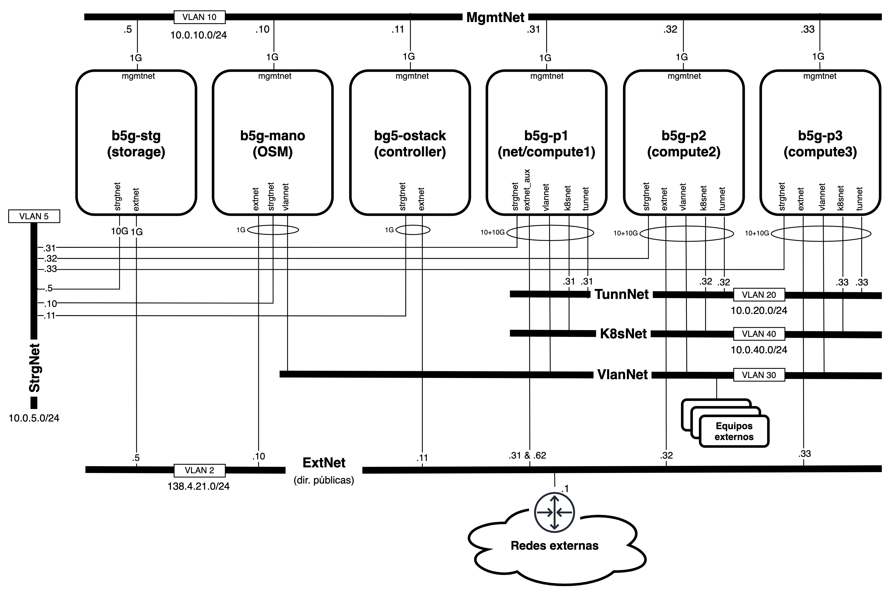

# B5Gemini ACROSS Experiment Stack

Este repositorio contiene los requisitos, instrucciones y scripts para ejecutar experimentos sobre el clúster B5Gemini.

## Índice

1. [Descripción del escenario](#descripción-del-escenario)
    - [Arquitectura y software](#arquitectura-y-software)
    - [Conexiones de red](#conexiones-de-red)
    - [Estructura del escenario virtual](#estructura-del-escenario-virtual)

2. [Despliegue del escenario y ejecución de experimentos](#despliegue-del-escenario-y-ejecución-de-experimentos)
    - [Instalación de clabernetes](#instalación-de-clabernetes)
    - [Modificación del despliegue para conectividad mediante VlanNet](#modificación-del-despliegue-para-conectividad-mediante-vlannet)
    - [Despliegue del Network emulation](#despliegue-del-network-emulation-mediante-una-topología-de-containerlab-en-clabernetes)
        - [Requisitos previos](#requisitos-previos)
        - [Procedimiento de despliegue](#procedimiento-de-despliegue)
    - [Despliegue del Monitoring stack y Apache Kafka](#despliegue-del-monitoring-stack-y-apache-kafka)
    - [Despliegue del ML Stack](#despliegue-del-ml-stack)
    - [Despliegue del Network control stack](#despliegue-del-network-control-stack)
    - [Despliegue del Experiment analysis stack](#despliegue-del-experiment-analysis-stack)
        - [Configuración inicial de InfluxDB](#configuración-inicial-de-influxdb)
        - [Configuración inicial de MinIO](#configuración-inicial-de-minio)
        - [Despliegue de los componentes](#despliegue-de-los-componentes)
    - [Ejecución de experimentos mediante el generador de tráfico Ixia-c](#ejecución-de-experimentos-mediante-el-generador-de-tráfico-ixia-c)

## Descripción del escenario

A efectos de los experimentos recogidos en este repositorio, el clúster B5Gemini cuenta con una máquina que actúa de controlador y otras cuatro que actúan como nodos de computación.

### Arquitectura y software


> El clúster cuenta con un nodo *compute4* adicional con la misma configuración, pero que no figura en este diagrama.

Tal y como se indica en el gráfico, sobre el clúster se encuentran desplegadas la plataforma de virtualización [OpenStack](https://www.openstack.org/) y la plataforma de orquestación de contenedores [Kubernetes](https://kubernetes.io/es/), sobre los que se ejecutará la infraestructura virtualizada para los experimentos.

Adicionalmente, sobre Kubernetes se ejecutan los siguientes componentes:

- [Calico CNI](https://github.com/projectcalico/calico)
- [Multus CNI](https://github.com/k8snetworkplumbingwg/multus-cni)
- [Ingress Nginx Controller](https://github.com/kubernetes/ingress-nginx)
- [MetalLB](https://metallb.io/)


### Conexiones de red

> El clúster cuenta con un nodo *compute4* adicional con la misma configuración, pero que no figura en este diagrama.

La conectividad entre nodos se establece mediante un conmutador que se para el tráfico en diversas interfaces. Los experimentos aquí recogidos se centran especialmente en el empleo de las red VLAN 30 con puentes de red virtuales que permitan establecer un segundo etiquetado para la segmentación del tráfico.

### Estructura del escenario virtual


El escenario virtual para experimentos cuenta con diversos componentes que trabajan conjuntamente:

- **[Network emulation:](https://github.com/giros-dit/vnx-srv6/tree/2a17b347e72d9924978e8420d59725933f514c7e/)** Red virtual de [containerlab](https://containerlab.dev) desplegada mediante [clabernetes](https://containerlab.dev/manual/clabernetes/) sobre la que cursar tráfico para realizar experimentos. Los enrutadores de la red de transporte reportan métricas al *Monitoring stack* y establecen sus rutas en función de los comandos del *Network control stack*. La conectividad entre nodos se realiza empleando redes VLAN (sobre la VlanNet) a través de interfaces de *Multus*, lo que permite reducir significativamente la latencia de los enlaces.

- **[Monitoring stack:](https://github.com/giros-dit/ACROSS-monitoring-stack/tree/97993debcef5e3796ac7907b4f74273fa063a22b/)** Recoge y procesa las métricas de las interfaces seleccionadas de los enrutadores de la red de transporte para ponerlas a disposición del *ML Stack*.

- **ML stack:** Realiza el cálculo de consumo energético a partir de las métricas proporcionados por el *Monitoring stack* para su uso en la creación de rutas por parte del *Network control stack*.

- **[Network control stack:](https://github.com/giros-dit/vnx-srv6/tree/cd0890802a325ba039d846fd72e0de349b1cb786/NetworkControlStack/)** Realiza el cálculo de rutas en función de los datos proporcionados por el *ML stack*.

- **NDT Data Fabric:** Despliegue de Apache Kafka en el que cada uno de los componentes publica los datos procesados, empleando para ello un *topic* por enrutador y etapa.

- **[Experiment analysis stack:](https://github.com/giros-dit/experiment-analysis-stack/tree/cf000addb114eb5441d7c730310f22dd3bb3d11b/)** Consta de una instancia de [*InfluxDB*](https://www.influxdata.com/products/influxdb/) para almacenar series temporales y visualizar los datos de telemetría en tiempo real. Además, cuenta con una instancia del servidor de almacenamiento [*MinIO*](https://min.io/) en el que se almacena una replica de los datos de forma permanente y en formato compatible con *S3*. Es el único conjunto de recursos desplegado sobre una máquina virtual "pesada" en *OpenStack*.

## Despliegue del escenario y ejecución de experimentos

Esta sección contiene las instrucciones para la puesta en marcha del escenario virtual, asumiendo que ya se cuenta con un clúster de Kubernetes completamente funcional y con el software necesario descrito en la sección de [Arquitectura y Software](#arquitectura-y-software).

### Instalación de *clabernetes*
La [guía de inicio rápido de clabernetes](https://containerlab.dev/manual/clabernetes/quickstart/) recoge los comandos necesarios para instalar la herramienta en nuestro clúster de Kubernetes para encargarse de la conversión de los objetos *Topology* que despleguemos sobre el mismo. A continuación se recoge un resumen de los comandos necesarios para su puesta en marcha:

```shell
alias helm='docker run --network host -ti --rm -v $(pwd):/apps -w /apps \
    -v ~/.kube:/root/.kube -v ~/.helm:/root/.helm \
    -v ~/.config/helm:/root/.config/helm \
    -v ~/.cache/helm:/root/.cache/helm \
    alpine/helm:3.12.3'
```

```shell
helm upgrade --install --create-namespace --namespace c9s \
    clabernetes oci://ghcr.io/srl-labs/clabernetes/clabernetes
```

### Modificación del despliegue para conectividad mediante VlanNet
Para el empleo de la red VlanNet para la comunicación entre los nodos de clabernetes de nuestro escenario, es necesario poner a disposición de los *pods* los objetos *NetworkAttachmentDefinition* de *Multus* que permiten la conexión con interfaces del host del nodo *worker* de Kubernetes.

Un **ejemplo** del comando de definición de estos objetos es la siguiente:

```shell
NS=c9s-nodes3; cat <<EOF | kubectl create -f -
apiVersion: "k8s.cni.cncf.io/v1"
kind: NetworkAttachmentDefinition
metadata:
  name: net1000
  namespace: $NS
spec:
  config: '{
      "cniVersion": "0.3.0",
      "type": "macvlan",
      "master": "br-vlan.1000",
      "mode": "bridge",
      "ipam": {}
    }'
EOF
```

> Si el nombre esta definición no coincide con la establecida en el fichero de topología de containerlab **los pods no arrancarán**.

### Despliegue del *Network emulation* mediante una topología de containerlab en clabernetes
El despliegue de una topología de containerlab en clabernetes resulta trivial empleando la herramienta `clabverter`. **Esta herramienta ha sido [modificada](https://github.com/giros-dit/clabernetes/tree/d6ef1739a27d58ea0f14a8bf7e9898a63946f050/clabverter/) para nuestro escenario, de modo que se generen los parches necesarios para el uso de interfaces creadas mediante *Multus*.** Para ello, basta con indicar en el fichero de topología un elemento *link* en el que uno de los enlaces sea de tipo *Multus* `"multus:<nombre de la interfaz>"`.

> Si el nombre esta interfaz no coincide con la establecida en la definición de un objeto de tipo *NetworkAttachmentDefinition* de *Multus* desplegado en el *namespace* de nuestra topología **los pods no arrancarán**.

Para poder emplear clabverter directamente desde la línea de comandos y sin realizar instalaciones, ejecutaremos:

```shell
alias clabverter='sudo docker run --user $(id -u) \
    -v $(pwd):/clabernetes/work --rm \
    ghcr.io/giros-dit/clabernetes/clabverter'
```

> Al tratarse de una imagen almacenada de forma privada en el registro de contenedores de la organización de GitHub, es necesario autenticarse para acceder a ella. El procedimiento para generar un token de autenticación puede encontrarse [aquí](https://docs.github.com/es/packages/working-with-a-github-packages-registry/working-with-the-container-registry#autenticarse-en-el-container-registry).

Para usar clabverter basta con desplazarse al directorio en el que se encuentra nuestra topología y ejecutar:

```shell
clabverter --naming non-prefixed --outputDirectory ./converted
```
> Por el momento, esta versión de clabverter solo funciona correctamente si se encuentra presente el parámetro `--naming non-prefixed`.
> Pueden consultarse un listado completo de opciones ejecutando `clabverter -h`.

Esta imagen modificada de clabverter exportará los ficheros:
- `_<nombre de la topología>-ns.yaml`: Crea el *namespace* en el que se desplegará la topología. Puede omitirse si trabajamos sobre un *namespace* existente que haya sido definido mediante la opción `--namespace` de clabverter.

- `<nombre de la topología>.yaml`: Fichero que despliega un objeto *Topology* sobre el *namespace* indicado. Clabernetes creará automáticamente los recursos necesarios (*deployments*, *services*...) para ejecutar la topología.

- `deployment-patcher.sh`: Debe ejecutarse tras el despliegue en el clúster para realizar la configuración de las interfaces *Multus*.
 
- Ficheros adicionales: Como ficheros de configuración o licencias. Estos serán exportados como [ConfigMaps](https://kubernetes.io/docs/concepts/configuration/configmap/) de Kubernetes para su uso en el clúster.

> Para poder aplicar los parches se emplea la herramienta [`yq`](https://mikefarah.gitbook.io/yq) mediante [su imagen de Docker](https://hub.docker.com/r/mikefarah/yq). Para evitar errores, es recomendable ejecutar un `docker pull` con la imagen de la herramienta antes de ejecutar el `deployment_patcher.sh`. Las pruebas han sido realizadas con la versión 4.44.5.

Los experimentos cursados emplean principalmente las topologías [redAcross6nodes](https://github.com/giros-dit/vnx-srv6/tree/cd0890802a325ba039d846fd72e0de349b1cb786/clabernetes/redAcross6nodes/) y [redAcross10nodes](https://github.com/giros-dit/vnx-srv6/tree/cd0890802a325ba039d846fd72e0de349b1cb786/clabernetes/redAcross10nodes/).


### Despliegue del *Monitoring stack* y Apache Kafka

### Despliegue del *ML Stack*

### Despliegue del *Network control stack*

### Despliegue del *Experiment analysis stack*

El [*Experiment analysis stack*](https://github.com/giros-dit/experiment-analysis-stack/tree/77ea936418872a7176a505d9f102b8d02a8ca0b4/) está formado por una serie de contenedores Docker que ejecutan los siguientes servicios:

- [**InfluxDB:**](https://www.influxdata.com/products/influxdb/) Base de datos de series de tiempo e interfaz de visualización de gráficas en tiempo real.

- [**Telegraf:**](https://github.com/influxdata/telegraf) Colector de datos para InfluxDB con diversas integraciones (p. ej. *Kafka*) .

- [**MinIO:**](https://min.io/) Servidor de almacenamiento compatible con [*Amazon S3*](https://aws.amazon.com/es/s3/) para realizar copias persistentes de los datos de los experimentos.

- [**S3 Consumer**](https://github.com/giros-dit/experiment-analysis-stack/tree/f532f310a722a7f9bc00d7f147b9fc08385ce38b/s3_consumer.py): Script de *Python* que actúa como consumidor de *Kafka* y guarda los mensajes capturados en el almacenamiento de *MinIO*.

Este despliegue en *Docker Compose* es el único componente que requiere ser desplegado fuera del clúster, sobre una máquina virtual de OpenStack. En nuestro escenario, dicha máquina cuenta con los siguientes requisitos:

- 4 vCPU
- 8GB RAM
- 40GB HDD
- 1 dirección IP estática
- Ubuntu 22.04


Además, es requisito indispensable contar en dicha máquina con una instalación de [Docker](https://www.docker.com/).

#### Configuración inicial de InfluxDB

Previo al despliegue del fichero [docker-compose.yml](https://github.com/giros-dit/experiment-analysis-stack/tree/f532f310a722a7f9bc00d7f147b9fc08385ce38b/docker-compose.yml) es necesario inicializar una instancia temporal de *InfluxDB* para establecer la configuración inicial y almacenarla en un directorio persistente:

```shell
docker run \
    -p 8086:8086
    -v "$PWD/influx-data:/var/lib/influxdb2" \
    -v "$PWD/influx-config:/etc/influxdb2" \
    -e DOCKER_INFLUXDB_INIT_MODE=setup \
    -e DOCKER_INFLUXDB_INIT_USERNAME=<USERNAME> \
    -e DOCKER_INFLUXDB_INIT_PASSWORD=<PASSWORD> \
    -e DOCKER_INFLUXDB_INIT_ORG=<ORG_NAME> \
    -e DOCKER_INFLUXDB_INIT_BUCKET=<BUCKET_NAME> \
    influxdb:2
```
> La información completa acerca del uso de esta imagen puede consultarse en [*DockerHub*](https://hub.docker.com/_/influxdb).

Una vez iniciado, es necesario a acceder a la interfaz web para crear una nueva configuración para *telegraf*. Tras iniciar sesión, basta con navegar a la pestaña "Sources" de la opción de carga de datos del menú lateral.


En esta nueva página debe seleccionarse el plugin "Kafka Consumer":


A continuación basta con seguir los pasos indicados tras pulsar el botón "Use this plugin". El fichero de configuración del proyecto para la correcta captura de los campos de interés de las métricas puede consultarse [aquí](https://github.com/giros-dit/experiment-analysis-stack/tree/f532f310a722a7f9bc00d7f147b9fc08385ce38b/telegraf.conf).

Tras pulsar en "Save and test", *InfluxDB* devolverá un token de acceso y un ID de la configuración, necesarios para que *Telegraf* cargue dichos ajustes:


Esta instancia puede eliminarse una vez completada y almacenada la configuración, puesto que persistirá en el directorio montado como volumen.

#### Configuración inicial de MinIO

Previo al despliegue del fichero [docker-compose.yml](https://github.com/giros-dit/experiment-analysis-stack/tree/f532f310a722a7f9bc00d7f147b9fc08385ce38b/docker-compose.yml) es necesario inicializar una instancia temporal de *MinIO* para establecer la configuración inicial y almacenarla en un directorio persistente:

```shell
docker run \
    -p 9001:9001
    -v "$PWD/minio-data:/data" \
    -e MINIO_ROOT_USER=<USERNAME>
    -e MINIO_ROOT_PASSWORD=<PASSWORD>\
    quay.io/minio/minio
```

Una vez arrancado el contenedor, la interfaz de *MinIO* estará disponible desde `http://<ip_vm>:9001`. Desde ella es posible:

- Crear un nuevo *bucket* de datos en el que almacenar la información de los experimentos. Disponible en `http://<ip_vm>:9001/buckets`.

- Crear un nuevo usuario con permisos para leer y escribir en el *bucket*. Disponible en `http://<ip_vm>:9001/identity/users`.

- Crear un nuevo juego de claves con permisos para leer y escribir en el *bucket*. **Esta opción es una alternativa a la creación de un usuario** y permite mayor granularidad de permisos. Disponible en `http://<ip_vm>:9001/access-keys`.

Esta instancia puede eliminarse una vez completada y almacenada la configuración, puesto que persistirá en el directorio montado como volumen.

#### Despliegue completo

Para realizar el despliegue mediante el fichero [docker-compose.yml](https://github.com/giros-dit/experiment-analysis-stack/tree/f532f310a722a7f9bc00d7f147b9fc08385ce38b/docker-compose.yml), es necesario definir previamente una serie de variables de entorno a partir de los datos del resto de componentes configurados:

```shell
KAFKA_BROKER=<kafka_broker_ip>:<kafka_broker_port>
KAFKA_TOPICS=<kafka_topics>

TELEGRAF_HOSTNAME=<telegraf_hostname>
INFLUX_URL=http://<influx_url>:<influx_port>
TELEGRAF_CONFIG_ID=<telegraf_config_id>
INFLUX_TOKEN=<influx_token>
INFLUX_ORG=<influx_org>
INFLUX_BUCKET=<influx_bucket>

MINIO_USER=<minio_user>
MINIO_PASS=<minio_pass>
S3_ENDPOINT=http://<s3_endpoint_ip>:<s3_endpoint_port>
S3_ACCESS_KEY=<s3_access_key>
S3_SECRET_KEY=<s3_secret_key>
S3_BUCKET=<s3_bucket>
```

> Para facilitar la definición de estas variables, es recomendable agregarlas a un pequeño script de shell.

Tras estas definiciones, basta con levantar los contendores:

```shell
docker compose up -d
```


### Ejecución de experimentos mediante el generador de tráfico Ixia-c